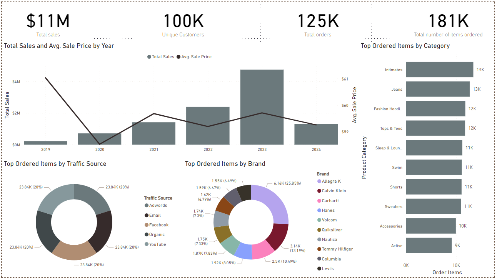
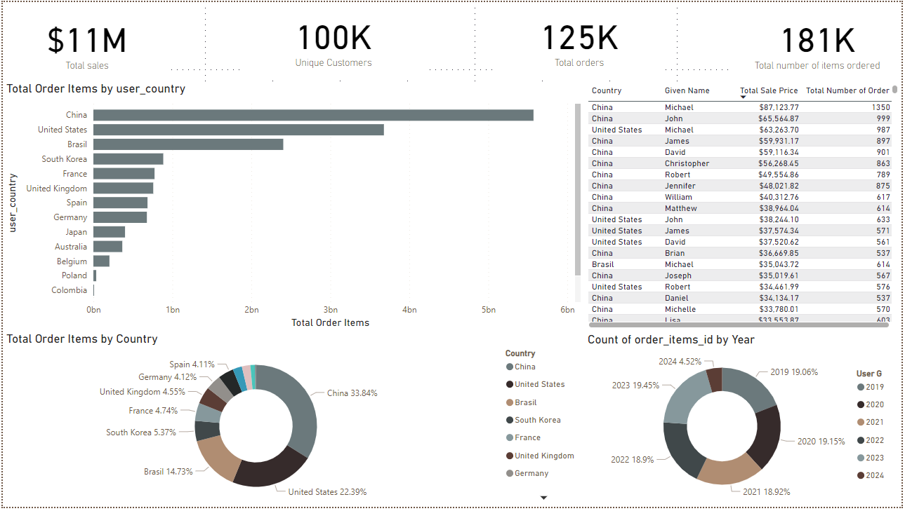
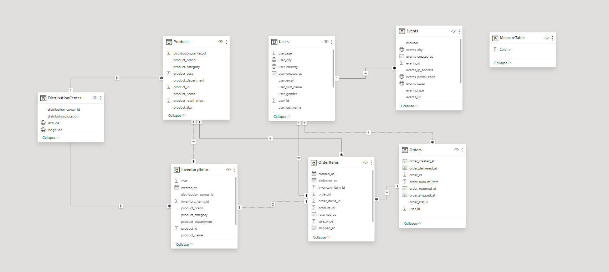
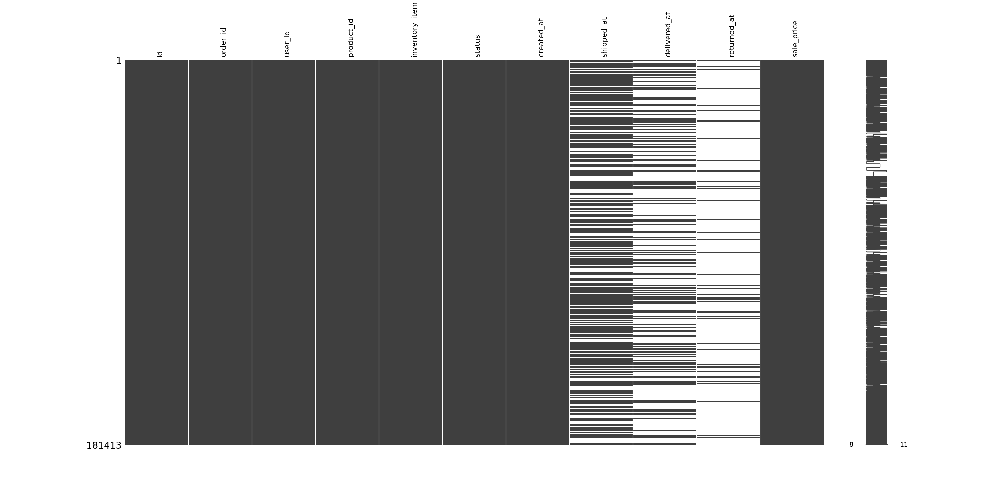
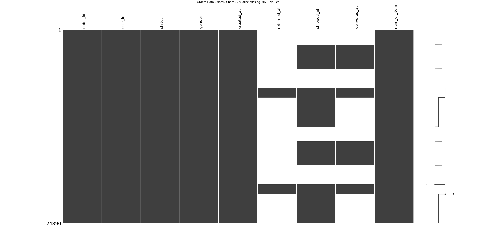

# Thinking Machine Data Science
Thinking Machines Solutions

<!-- Project Development -->
## Project Development Journey.
- The project's approach emphasized an end-to-end journey focusing on extraction, transformation, and loading (ETL), aiming to create insights from a large dataset using existing skill sets.
- Initial steps involved analyzing the dataset and schema inside BigQuery, revealing millions of rows in factual tables. The first extraction was performed using the BigQuery client, followed by loading into pandas DataFrames. Due to pandas' limitations with large datasets, including slow processing times, I transitioned to PySpark for improved data handling and analysis efficiency.
- To further understand the data model and relationships between tables, I utilized PowerBI's model view tool, which offers visual insights into how data is interconnected.
- Development initially took place on MacOS, but was later moved to WindowsOS to accommodate the PowerBi software. Therefore, to better managed the project quickly developed a basic Airflow nested inside Docker workflow to better manage the project, dependencies, and OS. This would also highlight my profiency in the area.
- Challenges with PySpark, particularly around setup and dependency management (e.g., HADOOP_HOME, JAVA_HOME), led me to abandon this direction due to the extensive setup time required, although worth exploring in the future.
- The project was concluded using Python for analysis, opting for a simpler approach to create basic insights into the dataset, illustrating the importance of tool selection in data analysis.

## Getting Started - Running the process.

1. Navigate to the project folder using the terminal
2. Run the following command. The command will run the data extraction. Note: This process only works for MacOS for now, since I am missing depencencies for Windows and Linux
   ```sh
   poetry run python dags/01_extract.py
   ```
3. Run the following command. The command will run the data exploration graphs.
   ```sh
   poetry run python dags/02_exploration.py
   ```
4. Run the following command. The command will run the data correlation graphs.
   ```js
   poetry run python dags/03_correlation.py
   ```
## Insights.

### PowerBI Dashboard
After the extract procedure, we developed and managed the data inside the PowerBi. Below are images of the dashboard and the data model. First, we manage the data relationship, data model, data types, data accuracy inside the model view. This ensures the data is highly accuracte and consistent before creating the report.

Afterwards, I created the dashboards to emphasize the overall summary of the data. Assuming the report would be an executive report for growth, I focused on sales and order counts with highly performing brands and categories. The summary dashboard highlights where we at right now, it terms of growth, and who are the key drivers behind the growth. The sales is steadily climbing 2020, 2021 until 2023, and then it started to drop - although we assumed that 2024 lacks data.

Second dashboard focuses on the customer data, where is our primary customers located at. The dashboard is focused on the top 10 locations with the highest number of customers. Also at the right, the breakdown of the customer itself.





### Python Graphs

#### Managing Missing Values
Moving over to python visualization, I have a few templates of function that graphs and captures missing values.




#### Correlation


## Technologies Used
- BigQuery
- Pandas
- PySpark
- PowerBI
- Docker*
- Airflow*
- Python